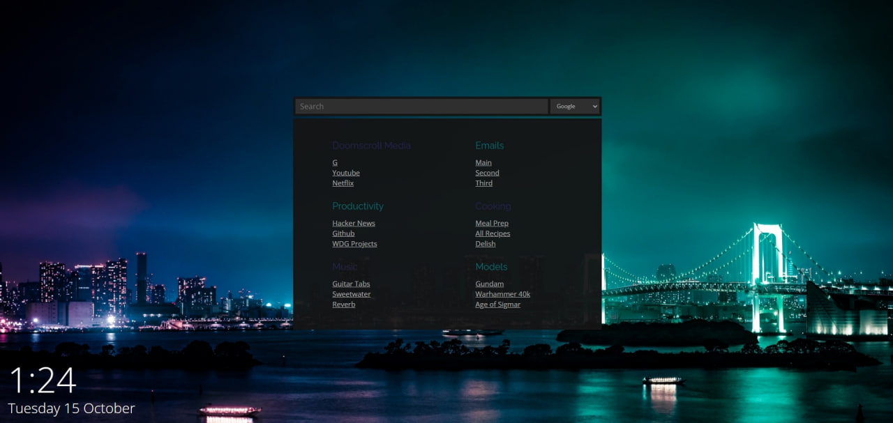
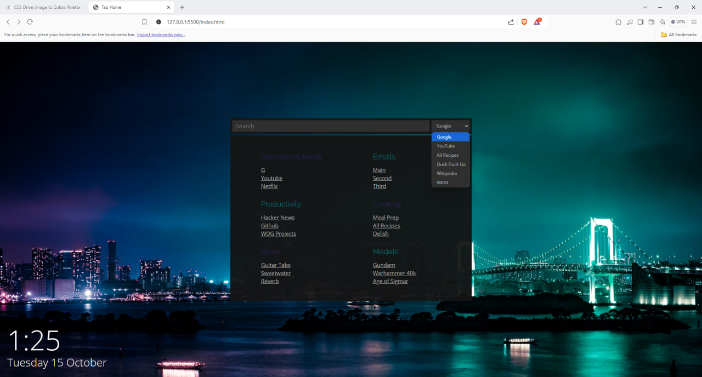

# Start Page

## Description
Start page is a replacement for the default landing page of my web browser. By replacing the blank new tab with something useful containing commonly used links as well as a search function. The search function can link directly to common searches such as Google, Youtube, or Allrecipes.

## Usage
Replace your default browser's new tab page with the website.

Click on any of the links to navigate to the sites.

Or use the search bar and drop down list of types of searches to quickly navigate.
## Credits

## License
MIT License